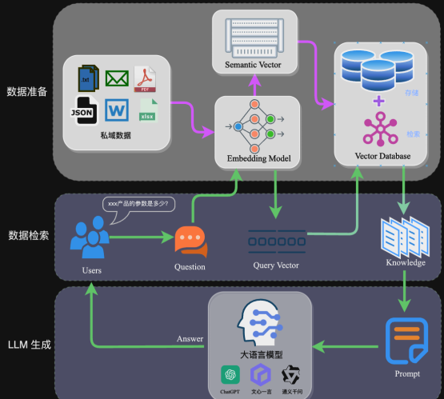

# LangChain实战
---
## LangChain简介

LangChain是一个用于开发由语言模型支持的应用程序的框架。
***
### 它具有以下的功能：

#### 具有上下文感知能力
将语言模型和资源上下文联系起来（提示说明, 少量的事例, 回复的内容等）。

#### 推理能力（reason）
依靠语言模型进行推测（根据提供的上下文，回答或采取相应的操作）。

#### 可以将 LLM 模型与外部数据源进行连接

#### 允许与 LLM 模型进行交互
### 专有名词：

#### Models（LLM 调用）

⭕️支持多种模型接口，比如 OpenAI、Hugging Face、AzureOpenAI ...

⭕️Fake LLM，用于测试缓存的支持，比如 in-mem（内存）、SQLite、Redis、SQL

⭕️用量记录

⭕️支持流模式（就是一个字一个字的返回，类似打字效果）

#### Prompts（Prompt管理）
支持各种自定义模板
#### Indexes（对索引的支持）

⭕️文档分割器

⭕️向量化

⭕️对接向量存储与搜索
#### Memory
#### Chains
⭕️LLMChain

⭕️各种工具Chain

⭕️LangChainHub

#### Agents
使用 LLMs 来确定采取哪些行动以及以何种顺序采取行动。操作可以是使用工具并观察其输出，也可以是返回给用户。如果使用得当，代理可以非常强大。
#### Callbacks
***
## 环境配置及工具
以下内容仅供参考：
```
OS:windows10/11 Linux
Python:3.10+
Ollama
Jupyter
Git
可能需要的工具
conda
docker
openai
```
### python
使用3.10+的版本，安装、升级、环境配置，这里不赘述。
### LangChain
#### LangChain安装
```
终端输入：
pip install langchain

使用清华源Pypi安装：
pip install langchain -i https://pypi.tuna.tsinghua.edu.cn/simple
```

### Ollama

管理本地的models。
#### Ollama安装
```
Ollama官方下载地址：
https://ollama.com/
```
#### Model下载
这里介绍本地部署，也可以通过服务器部署。
```
在Ollama官网选择自己想要的Model,在终端输入：
ollama run xxx
其中xxx为模型名，例：
ollama run llama2//拉取并运行llama2模型

ollama list//查看本地部署的模型
```
### jupyter
为我们python编译提供模块化便利。
#### jupyter安装
```
终端输入：
pip install jupyterlab

使用清华源Pypi安装：
pip install jupyterlab -i https://pypi.tuna.tsinghua.edu.cn/simple
```
#### jupyter运行
```
终端输入：
jupyter notebook//会弹出网页
```
***
## LCEL langchain表达式语言
### chain  链的使用
#### 提示词（prompt）+模型（model）+输出解释器（output parser）示例
单独使用LLM适用于简单的应用程序，但更复杂的应用程序需要将LLM链接起来，要么彼此链接，要么与其他组件链接。
```
from langchain_community.llms import Ollama #导入ollama包
from langchain_core.prompts import ChatPromptTemplate #提示词
from langchain_core.output_parsers import StrOutputParser #输出解析器
# from langchain_community.embeddings import GPT4AllEmbeddings #文本嵌入模型

prompt = ChatPromptTemplate.from_template("《三国演义》{topic}介绍")
model = Ollama(model="qwen:0.5b") #这里选gpu、cpu负担小的0.5b模型
output_parser = StrOutputParser()
chain = prompt | model | output_parser #组成一条链
chain.invoke({"topic": "曹操"})
```
输出结果：
```
'在《三国演义》中，曹操是一位非常有野心和智谋的人物。他性格豪放、武艺高强，在三国时期是一个非常重要的人物。\n\n曹操不仅是一个军事家，也是一个政治家和外交家。他曾经与刘备联手，共同开创了中国的历史和文化。\n\n总的来说，曹操是一位非常有野心和智谋的人物，他在三国时期有着非常重要的地位。\n'


注意：回答的内容与模型的选择有关，回答格式和输出解析器有关，这里转换为了python字符串。
```
**我们来分析下这段代码的流程：**

首先，我们将topic定为"曹操"，{"topic": "曹操"}。

prompt组件获取用户输入，然后在使用topic构造提示，用于构造 PromptValue。

model组件采用生成的提示，并传递到llama2模型进行评估。模型生成的输出是一个ChatMessage对象。

最后，该output_parser组件接收 aChatMessage并将其转换为 Python 字符串，该字符串从 invoke 方法返回。

&emsp;&emsp;&emsp;&emsp;&emsp;&emsp;&emsp;&emsp;&emsp;&emsp;&emsp;&emsp;&emsp;&emsp;&emsp;&emsp;&emsp;&emsp;&emsp;&emsp;&emsp;**流程图**
***
## RAG（Retrieval Augmented Generation）检索增强生成
### 什么是RAG？
**尽管我们已经获得了想要的回答，但是还存在着下面几个问题：**
#### 知识的局限性
模型自身的知识完全源于它的训练数据，而现有的主流大模型（ChatGPT、文心一言、通义千问…）都是构建于网络公开的数据，对于一些实时性的、非公开的或离线的数据是无法获取到的，这部分知识也就无从具备。
#### "幻觉"问题
AI modle的底层原理都是基于数学概率，其模型输出实质上是一系列数值运算，所以它有时候会一本正经地胡说八道。尤其是在大模型自身不具备某一方面的知识或不擅长的场景。在区分这些问题时，还需要使用者的知识背景。
#### 数据安全性 
对于企业来说，数据安全至关重要，没有企业愿意承担数据泄露的风险，上传第三方平台进行训练。这也导致完全依赖通用大模型自身能力的应用方案不得不在数据安全和效果方面进行取舍。

**我们现在所说的RAG就是在解决这些问题。**

### RAG框架
RAG的架构如图中所示，简单来讲，RAG就是通过检索获取相关的知识并将其融入Prompt，让大模型能够参考相应的知识从而给出合理回答。

&emsp;&emsp;&emsp;&emsp;&emsp;&emsp;&emsp;&emsp;&emsp;&emsp;&emsp;&emsp;&emsp;&emsp;&emsp;&emsp;&emsp;&emsp;&emsp;&emsp;&emsp;**RAG框架图**

因此，可以将RAG的核心理解为“检索+生成”，前者主要是利用向量数据库的高效存储和检索能力，召回目标知识；后者则是利用大模型和Prompt工程，将召回的知识合理利用，生成目标答案。

完整的RAG应用流程主要包含两个阶段：

数据准备阶段：数据提取——>文本分割——>文本向量化（embedding）——>数据入库
应用阶段：用户提问——>数据检索——>生成Prompt——>LLM生成答案
***
### RAG示例
#### LLM
```
# 导入ollama包
from langchain_community.llms import Ollama

# 通过ollama远程获取千问7b模型
model = Ollama(model="qwen:7b",base_url="http://192.168.3.122:11435")
```
不管RAG有多厉害，还是基于LLM的，脱离了LLM的RAG会缺乏“人”的感觉。

**目前主流的LLM有：**

国外有：Openai-ChatGPT、Google-LaMDA、Llama等。

国内有：百度-Ernie 3.0 Titan、智谱AI-GLM、阿里-M6、通义千问等。
#### 文档加载器
```
# txt文本加载器
from langchain.document_loaders import TextLoader
loader = TextLoader('Data/宇宁无锡考勤.txt',encoding="utf-8")
doc = loader.load()
doc
```
输出结果：
```
[Document(page_content='无锡宇宁智能科技有限公司（无锡）考勤管理制度\n从2024年2月1日起执行\n第一章总则\n第一条为规范员工管理，提高工作效率，保证各项工作的正常运行，根据有关法律法规，结合本公司实际情况，特制定本制度。\n第二条本制度适用人员范围为宇宁智能（无锡）全体人员。\n第二章细则\n第一节考勤打卡规范\n第三条实行打卡考勤的人员范围\n本公司员工除下列人员外，均应按规定打卡。\n1、\t总经理、其他总经理特批者；\n2、\t因公出差者：\n3、\t其他驻外机构人员。\n第四条考勤打卡时间及说明\n1、\t上下班时间：09:00-12:10，13:40-18:00其中工厂：08:00-11:45，12:40-17:00\n2、\t员工上下班必须打卡

······

```
这里以txt文本为例，langchain还支持word、txt、xlsx、json、PDF、Web浏览器等格式的文本加载。
#### 文档分割器（chucking）
```
# 文档分割
from langchain.text_splitter import CharacterTextSplitter
from langchain_text_splitters import RecursiveCharacterTextSplitter

# 创建拆分器 128个字符分割为一组,重叠暂时不设置
text_splitter = RecursiveCharacterTextSplitter(chunk_size=128, 
                                               chunk_overlap=0,
                                               separators=["\n"])

# 拆分文档
documents = text_splitter.split_documents(doc)
documents
```
输出结果：
```
[Document(page_content='无锡宇宁智能科技有限公司（无锡）考勤管理制度\n从2024年2月1日起执行\n第一章总则\n第一条为规范员工管理，提高工作效率，保证各项工作的正常运行，根据有关法律法规，结合本公司实际情况，特制定本制度。\n第二条本制度适用人员范围为宇宁智能（无锡）全体人员。', metadata={'source': 'Data/宇宁无锡考勤.txt'}),
 Document(page_content='第二章细则\n第一节考勤打卡规范\n第三条实行打卡考勤的人员范围\n本公司员工除下列人员外，均应按规定打卡。\n1、\t总经理、其他总经理特批者；\n2、\t因公出差者：\n3、\t其他驻外机构人员。\n第四条考勤打卡时间及说明', metadata={'source': 'Data/宇宁无锡考勤.txt'}),
 Document(page_content='1、\t上下班时间：09:00-12:10 
 
 ······
 ```
 将文本分割为128个字符为一组，为了实现内容检索的准确性，这里可以细分为段落、甚至逐句逐词分割。

 #### 文本向量嵌入 （embedding）
 ```
# 接下来对分割后的数据进行embedding，并写入数据库。

# 选用OpenAIEmbeddings作为embedding模型
from langchain.embeddings.openai import OpenAIEmbeddings

# 向量数据库选用FAISS。
from langchain.vectorstores import FAISS

#这里填写的本人的openai key
API_SECRET_KEY = "***";
embedding = OpenAIEmbeddings(openai_api_key=API_SECRET_KEY)
docsearch = FAISS.from_documents(documents, embedding)
docsearch.similarity_search("宇宁")
```
输出结果：
```
# 有关“宇宁”相关的数据库检索
[Document(page_content='无锡宇宁智能科技有限公司（无锡）考勤管理制度\n从2024年2月1日起执行\n第一章总则\n第一条为规范员工管理，提高工作效率，保证各项工作的正常运行，根据有关法律法规，结合本公司实际情况，特制定本制度。\n第二条本制度适用人员范围为宇宁智能（无锡）全体人员。', metadata={'source': 'Data/宇宁无锡考勤.txt'}),
 Document(page_content='第二十条调休', metadata={'source': 'Data/宇宁无锡考勤.txt'})

 ······
```
文本嵌入模型和向量数据库的选择，对检索库的量级和准确性至关重要。这里使用openai embedding的api接口和Faiss （cpu）数据库运行。

**目前主流的开源Embedding有：**

BGE、me3、通义千问embedding、text-embedding-ada-002等。

**目前主流的向量数据库有：**

Milvus、Weaviate、qdrant等等。


#### 提示词
```
# Prompt设计

from langchain.prompts import ChatPromptTemplate
template = """你是问答任务助手。使用以下检索到的上下文片段来回答问题。如果你不知道答案，就说你不知道。最多使用三个句子，保持答案简洁。
Question: {question} 
Context: {context} 
Answer:
"""
prompt = ChatPromptTemplate.from_template(template)

print(prompt)
```
输出结果：
```
input_variables=['context', 'question'] messages=[HumanMessagePromptTemplate(prompt=PromptTemplate(input_variables=['context', 'question'], template='你是问答任务助手。使用以下检索到的上下文片段来回答问题。如果你不知道答案，就说你不知道。最多使用三个句子，保持答案简洁。\nQuestion: {question} \nContext: {context} \nAnswer:\n'))]
```
Prompt是指告诉语言模型如何根据示例或指令进行响应的行为。简单来说，这里我们可以插入问题模板或告知一些上下文，对于回答的准确性有重要意义。在实际业务场景中需要针对场景特点针对性调优。

#### 对话式检索式查询
```
# 为聊天记录添加buffer缓存
from langchain.memory import ConversationBufferMemory
from langchain.chains import ConversationalRetrievalChain
retriever = docsearch.as_retriever()
memory = ConversationBufferMemory(memory_key="chat_history", return_messages=True)
# 对话式检索问答
qa = ConversationalRetrievalChain.from_llm(model, retriever, memory=memory)
qa({"question": "无锡工厂上班时间"})
```
```
{'question': '无锡工厂上班时间',
 'chat_history': [HumanMessage(content='无锡工厂上班时间'),
  AIMessage(content='无锡工厂的上班时间为：\n\n- 上午：08:00 - 11:45\n- 下午：12:40 - 17:00\n\n请注意，这些时间是工厂的整体工作时间，并非员工打卡的时间。\n')],
 'answer': '无锡工厂的上班时间为：\n\n- 上午：08:00 - 11:45\n- 下午：12:40 - 17:00\n\n请注意，这些时间是工厂的整体工作时间，并非员工打卡的时间。\n'}
 ```
 例子中从文档中获取了无锡工厂员工的上班时间。

 这里采用ConversationalRetrievalChain提供了历史聊天记录组件。定义了memory来追踪聊天记录，在流程上，先将历史问题和当前输入问题融合为一个新的独立问题，然后再进行检索，获取问题相关上下文知识，最后将获取的知识和生成的新问题注入Prompt让大模型生成回答。

 此外，langchain还提供了多查询检索器、长上下文重新排序、上下文压缩等检索方式。
 ***
 ## 总结
 langchin为我们应用LLM提供了一个完整的框架，可以在现有的模型基础上进行提示词、文档chuck、以及检索方式的调优。本文只是简单介绍了langchain的使用，以一个简单的RAG为例，更多内容请参考文献:
 
 https://python.langchain.com/docs/get_started/introduction


